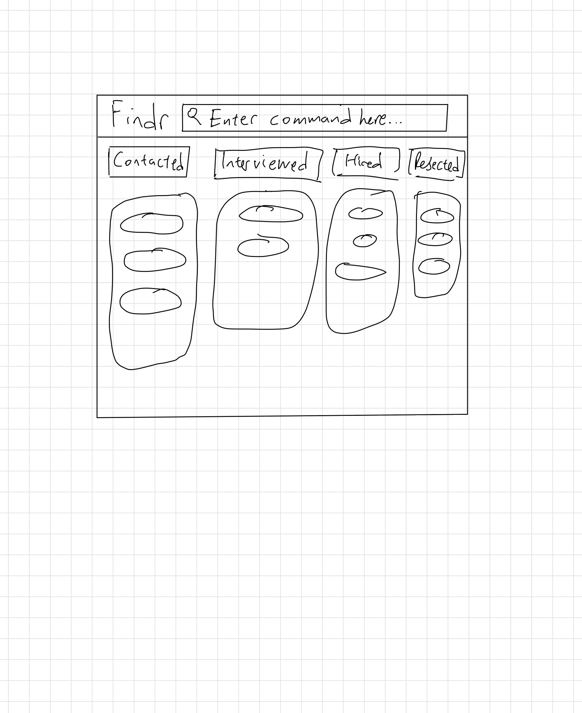

* Findr aims to equip recruiters with a one-stop solution for tech talent. Go beyond the resume to find the perfect fit.

  What findr can do: 
  * centralizes candidate data
  * streamlines communication
  * provides analytics to help you identify, assess, and engage top-tier candidates
* The project simulates an ongoing software project for a desktop application (called _findr_) used for managing contact details.
  * It is **written in OOP fashion**. It provides a **reasonably well-written** code base **bigger** (around 6 KLoC) than what students usually write in beginner-level SE modules, without being overwhelmingly big.
  * It comes with a **reasonable level of user and developer documentation**.
* For the detailed documentation of this project, see the **[findr Product Website](https://ay2526s1-cs2103t-f14a-2.github.io/tp/)**.
* This project is a **part of the se-education.org** initiative. If you would like to contribute code to this project, see [se-education.org](https://se-education.org/#contributing-to-se-edu) for more info.
