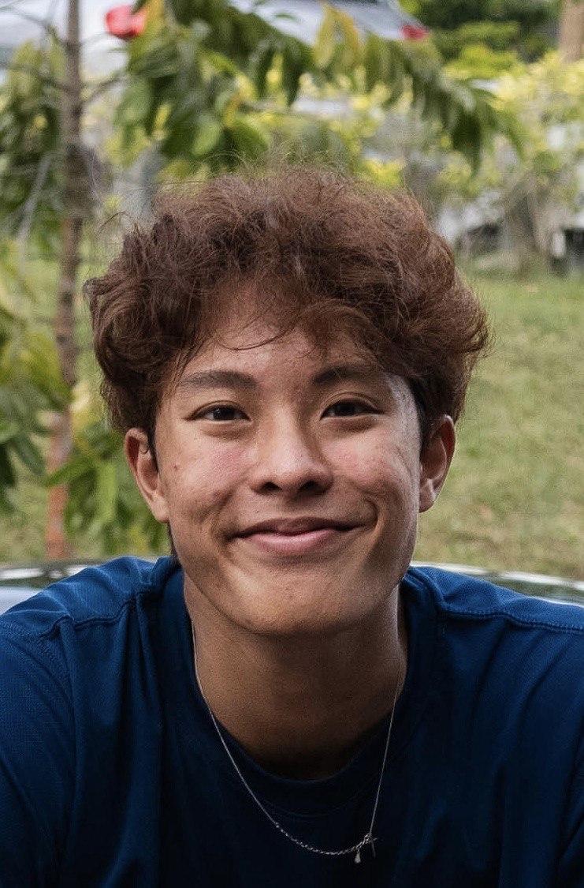
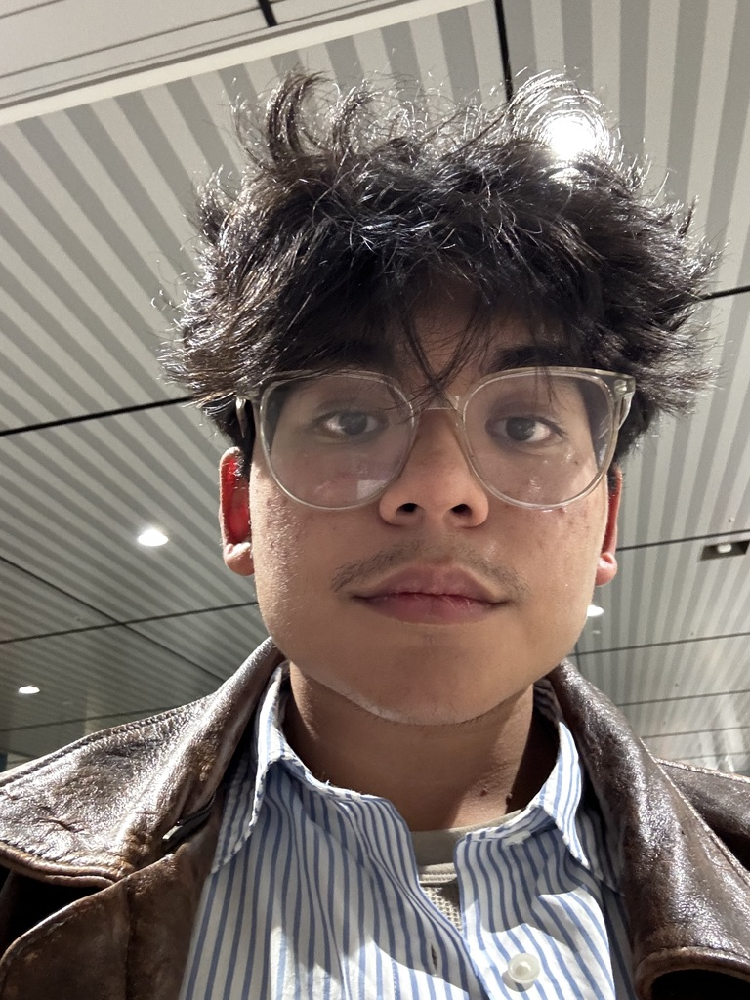
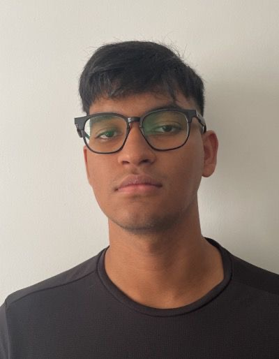

We are a team based in the [School of Computing, National University of Singapore](https://www.comp.nus.edu.sg).

You can reach us at the email `seer[at]comp.nus.edu.sg`

## Project team

### Zhu Qixuan

[[homepage](https://www.linkedin.com/in/qixuan-zhu-585926299/)]
[[github](https://github.com/qiiiixuan)]
[[portfolio](team/qixuan.md)]

* Role: Team Lead
* Responsibilities: Allocate tasks

### Julius Gwee

[[github](http://github.com/julius-gwee)]
[[portfolio](team/julius-gwee.md)]

* Role: Team Manager
* Responsibilities: Scheduling and Tracking, UI

### Cabansay Dominic Deen Lor

[[github](http://github.com/dominicddl)] [[portfolio](team/dominicddl.md)]

* Role: Integration
* Responsibilities: In charge of versioning of the code, maintaining the code repository, integrating various parts of the software to create a whole.

### Mohamad Isyraq

[[github](http://github.com/isyraqyusof)]
[[portfolio](team/isyraqyusof.md)]

* Role: Deliverables and deadlines
* Responsibilities: Ensure project deliverables are done on time and in the right format.

### James Doe

[[github](http://github.com/johndoe)]
[[portfolio](team/johndoe.md)]

* Role: Developer
* Responsibilities: UI
