* Table of Contents
{:toc}

--------------------------------------------------------------------------------------------------------------------

## **Acknowledgements**

* Libraries used: [JavaFX](https://openjfx.io/), [Jackson](https://github.com/FasterXML/jackson), [JUnit5](https://github.com/junit-team/junit5)

--------------------------------------------------------------------------------------------------------------------

## **Setting up, getting started**

Refer to the guide [_Setting up and getting started_](SettingUp.md).

--------------------------------------------------------------------------------------------------------------------

## **Design**

<div markdown="span" class="alert alert-primary">

:bulb: **Tip:** The `.puml` files used to create diagrams are in this document `docs/diagrams` folder. Refer to the [_PlantUML Tutorial_ at se-edu/guides](https://se-education.org/guides/tutorials/plantUml.html) to learn how to create and edit diagrams.
</div>

### Architecture


The ***Architecture Diagram*** given above explains the high-level design of the App.

Given below is a quick overview of main components and how they interact with each other.

**Main components of the architecture**

**`Main`** (consisting of classes [`Main`](https://github.com/se-edu/addressbook-level3/tree/master/src/main/java/seedu/address/Main.java) and [`MainApp`](https://github.com/se-edu/addressbook-level3/tree/master/src/main/java/seedu/address/MainApp.java)) is in charge of the app launch and shut down.
* At app launch, it initializes the other components in the correct sequence, and connects them up with each other.
* At shut down, it shuts down the other components and invokes cleanup methods where necessary.

The bulk of the app's work is done by the following four components:

* [**`UI`**](#ui-component): The UI of the App.
* [**`Logic`**](#logic-component): The command executor.
* [**`Model`**](#model-component): Holds the data of the App in memory.
* [**`Storage`**](#storage-component): Reads data from, and writes data to, the hard disk.

[**`Commons`**](#common-classes) represents a collection of classes used by multiple other components.

**How the architecture components interact with each other**

The *Sequence Diagram* below shows how the components interact with each other for the scenario where the user issues the command `delete 1`.

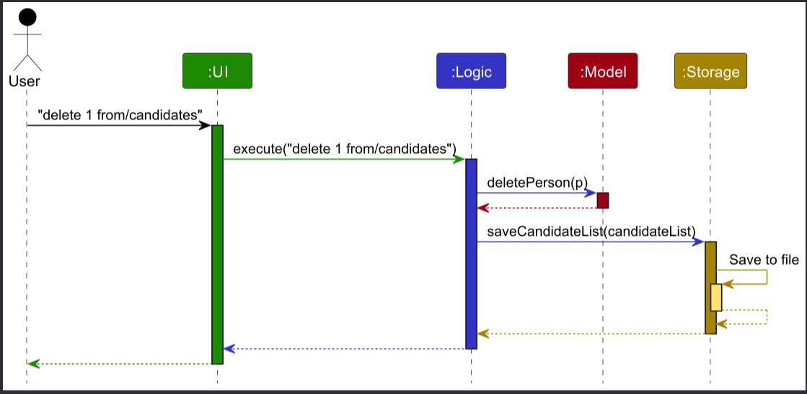

Each of the four main components (also shown in the diagram above),

* defines its *API* in an `interface` with the same name as the Component.
* implements its functionality using a concrete `{Component Name}Manager` class (which follows the corresponding API `interface` mentioned in the previous point.

For example, the `Logic` component defines its API in the `Logic.java` interface and implements its functionality using the `LogicManager.java` class which follows the `Logic` interface. Other components interact with a given component through its interface rather than the concrete class (reason: to prevent outside component's being coupled to the implementation of a component), as illustrated in the (partial) class diagram below.


The sections below give more details of each component.

### UI component

The **API** of this component is specified in [`Ui.java`](https://github.com/se-edu/addressbook-level3/tree/master/src/main/java/seedu/address/ui/Ui.java)

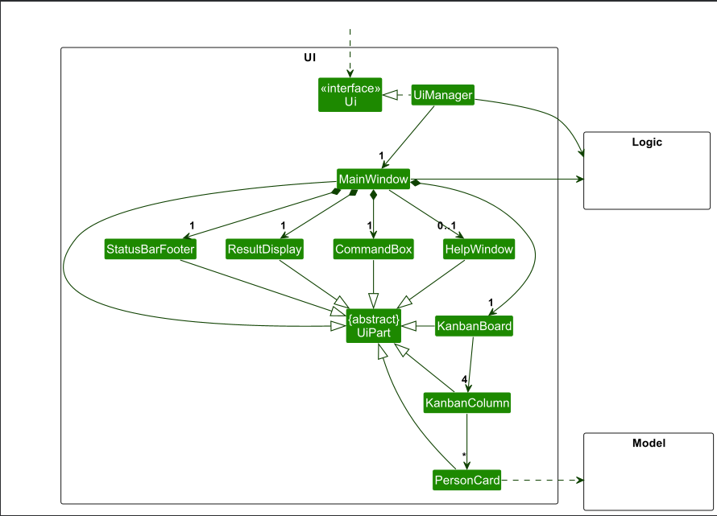

The UI consists of a `MainWindow` that is made up of parts e.g.`CommandBox`, `ResultDisplay`, `PersonListPanel`, `StatusBarFooter` etc. All these, including the `MainWindow`, inherit from the abstract `UiPart` class which captures the commonalities between classes that represent parts of the visible GUI.

The `UI` component uses the JavaFx UI framework. The layout of these UI parts are defined in matching `.fxml` files that are in the `src/main/resources/view` folder. For example, the layout of the [`MainWindow`](https://github.com/se-edu/addressbook-level3/tree/master/src/main/java/seedu/address/ui/MainWindow.java) is specified in [`MainWindow.fxml`](https://github.com/se-edu/addressbook-level3/tree/master/src/main/resources/view/MainWindow.fxml)

The `UI` component,

* executes user commands using the `Logic` component.
* listens for changes to `Model` data so that the UI can be updated with the modified data.
* keeps a reference to the `Logic` component, because the `UI` relies on the `Logic` to execute commands.
* depends on some classes in the `Model` component, as it displays `Person` object residing in the `Model`.

### Logic component

**API** : [`Logic.java`](https://github.com/se-edu/addressbook-level3/tree/master/src/main/java/seedu/address/logic/Logic.java)

Here's a (partial) class diagram of the `Logic` component:


The sequence diagram below illustrates the interactions within the `Logic` component, taking `execute("delete 1")` API call as an example.


<div markdown="span" class="alert alert-info">

:information_source: **Note:** The lifeline for `DeleteCommandParser` should end at the destroy marker (X) but due to a limitation of PlantUML, the lifeline continues till the end of diagram.
</div>

How the `Logic` component works:

1. When `Logic` is called upon to execute a command, it is passed to a `FindrParser` object which in turn creates a parser that matches the command (e.g. `DeleteCommandParser`) and uses it to parse the command.
1. This results in a `Command` object (more precisely, an object of one of its subclasses e.g. `DeleteCommand`) which is executed by the `LogicManager`.
1. The command can communicate with the `Model` when it is executed (e.g. to delete a person).<br>
   Note that although this is shown as a single step in the diagram above (for simplicity), in the code it can take several interactions (between the command object and the `Model`) to achieve.
1. The result of the command execution is encapsulated as a `CommandResult` object which is returned back from `Logic`.

Here are the other classes in `Logic` (omitted from the class diagram above) that are used for parsing a user command:


How the parsing works:
* When called upon to parse a user command, the `FindrParser` class creates an `XYZCommandParser` (`XYZ` is a placeholder for the specific command name e.g. `AddCommandParser`) which uses the other classes shown above to parse the user command and create a `XYZCommand` object (e.g. `AddCommand`) which the `FindrParser` returns back as a `Command` object.
* All `XYZCommandParser` classes (e.g. `AddCommandParser`, `DeleteCommandParser`, ...) inherit from the `Parser` interface so that they can be treated similarly where possible e.g, during testing.

### Model component
**API** : [`Model.java`](https://github.com/se-edu/addressbook-level3/tree/master/src/main/java/seedu/address/model/Model.java)

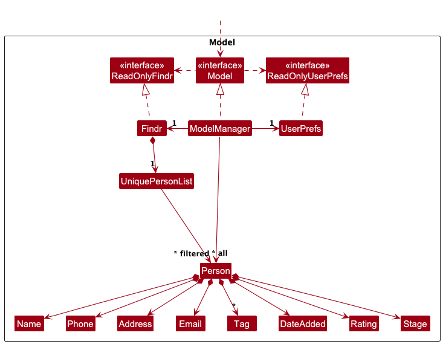


The `Model` component,

* stores the findr data i.e., all `Person` objects (which are contained in a `UniquePersonList` object).
* stores the currently 'selected' `Person` objects (e.g. results of a search query) as a separate _filtered and sorted_ list which is exposed to outsiders as an unmodifiable `ObservableList<Person>` that can be 'observed' e.g. the UI can be bound to this list so that the UI automatically updates when the data in the list change.
* stores a `UserPref` object that represents the user’s preferences. This is exposed to the outside as a `ReadOnlyUserPref` objects.
* does not depend on any of the other three components (as the `Model` represents data entities of the domain, they should make sense on their own without depending on other components)

<div markdown="span" class="alert alert-info">:information_source: **Note:** An alternative (arguably, a more OOP) model is given below. It has a `Tag` list in the `Findr`, which `Person` references. This allows `Findr` to only require one `Tag` object per unique tag, instead of each `Person` needing their own `Tag` objects.<br>

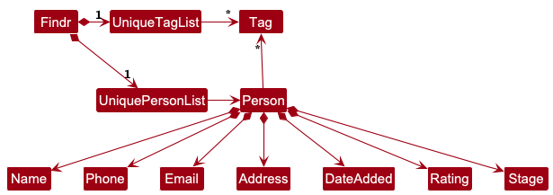

</div>


### Storage component

**API** : [`Storage.java`](https://github.com/se-edu/addressbook-level3/tree/master/src/main/java/seedu/address/storage/Storage.java)

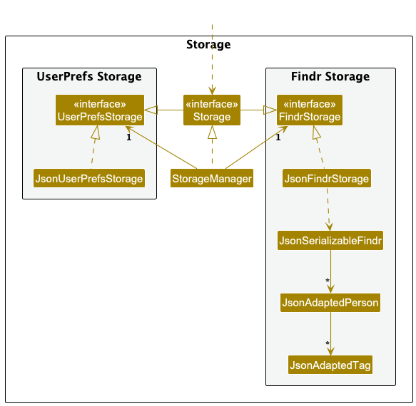

The `Storage` component,
* can save both findr data and user preference data in JSON format, and read them back into corresponding objects.
* inherits from both `FindrStorage` and `UserPrefStorage`, which means it can be treated as either one (if only the functionality of only one is needed).
* depends on some classes in the `Model` component (because the `Storage` component's job is to save/retrieve objects that belong to the `Model`)

### Common classes

Classes used by multiple components are in the `seedu.address.commons` package.

--------------------------------------------------------------------------------------------------------------------

## **Implementation**

This section describes some noteworthy details on how certain features are implemented.

---

### Managing Candidates

#### Implementation

The `Person` class under the `model.person` package represents a **candidate** in Findr.  
It contains the following fields:

- `Name` – candidate’s full name.
- `Phone` – candidate’s phone number.
- `Email` – candidate’s email address.
- `Address` – candidate’s address.
- `Tags` – a set of tag references used to classify candidates (e.g. `backend`, `urgent`, `frontend`).
- `Stage` – indicates which recruitment stage the candidate is currently in (e.g. `Candidates`, `Contacted`, `Interviewed`, `Hired`).
- `Rating` – reflects the recruiter’s qualitative evaluation of the candidate (e.g. `Excellent`, `Good`, `Average`, etc.).
- `DateAdded` – the date the candidate was added to Findr.

Each `Person` is **immutable**, and all fields are validated upon creation.

All `Person` objects are stored within a `UniquePersonList`, which ensures there are no duplicate candidates and provides efficient lookup and update operations. The list is managed by the `ModelManager`, which handles all modifications triggered by commands.

---

#### Design Considerations

**Aspect: Representing recruitment stages and ratings**

| Design Choice                                            | Pros | Cons |
|----------------------------------------------------------|------|------|
| Use Enum types (`Stage`, `Rating`) as opposed to Strings | Prevents invalid values and simplifies filtering | Requires explicit updates when adding new values |

**Aspect: Default system fields for stage and rating**

| Design Choice | Pros                                                                                                                                                                                                                               | Cons |
|----------------|------------------------------------------------------------------------------------------------------------------------------------------------------------------------------------------------------------------------------------|------|
| Treat as optional fields (default to `CANDIDATES`, `UNRATED`) | Ensures all candidates have valid stage and rating.<br/>Ensures candidate follows proper workflow (starts as an `UNRATED` `CANDIDATE`) before being moved to the another stage (`MoveCommand`) and given a rating (`RateCommand`). | Users cannot set these at creation |

---

### **Rating System**
#### Implementation
- Each `Person` has a `Rating` field that represents their evaluation score.

- `Rating` is an enum representing qualitative evaluations.

```java
public enum Rating {
    UNRATED("Unrated", 5),
    VERY_POOR("Very Poor", 4),
    POOR("Poor", 3),
    AVERAGE("Average", 2),
    GOOD("Good", 1),
    EXCELLENT("Excellent", 0);
} 
```
- The RateCommand allows recruiters to update this field:

  `rate INDEX from/STAGE r/RATING`

  - For example:
`rate 2 from/Interviewed r/Excellent` updates the 2nd candidate in the Interviewed stage to have a GOOD rating.
- `RateCommand` updates a candidate’s rating immutably:
    1. Finds candidate by index and stage.
    2. Creates new `Person` instance with updated rating.
    3. The model replaces the old instance using setPerson().
    4. The updated data is persisted to storage and UI is refreshed.

---
#### Design Considerations

**Aspect: Displaying ratings**

| Design Choice                                                            | Pros | Cons |
|--------------------------------------------------------------------------|--|------|
| Show text labels (e.g. “Excellent”) as opposed to star icons or colours. | Clear meaning | Takes up more UI space |

---
### **Stage Management**
#### Implementation

- The recruitment process in Findr is visualized as a kanban board, with each column corresponding to a recruitment stage:
`Candidates`, `Contacted`, `Interviewed`, and `Hired`.

These stages are implemented as an enum class:
```java
public enum Stage {
    CANDIDATES,
    CONTACTED,
    INTERVIEWED,
    HIRED
}
```

- Each candidate is assigned a Stage value that determines which column they appear under.

- The MoveCommand allows recruiters to move candidates between these stages: `move INDEX from/CURRENT_STAGE to/NEW_STAGE`
  - The command retrieves the candidate from the specified stage and index.
  - Updates their Stage field, and replaces the old candidate with the updated one in the model. 
  - This is done immutably via the Model#setPerson(Person target, Person editedPerson) method.

The UI automatically reflects the change by re-filtering candidates based on their new stage.

---
#### Design Considerations

**Aspect: Handling move operations**

| Design Choice                                                                                      | Pros                                   | Cons |
|----------------------------------------------------------------------------------------------------|----------------------------------------|------|
| Create new `Person` instance with updated stage as opposed to modifying exiting `Person` directly. | Immutability ensures model consistency | Slight overhead in object creation |

---
### **Tag Catalogue Management**
#### Implementation

Findr introduces a **Tag Catalogue**, allowing recruiters to define reusable tags with extra metadata such as color, category, and description.

Tags are represented by the `Tag` class in the `model.tag` package with the following fields:
- tagName 
- category 
- color (hexadecimal)
- description

Each candidate’s tag set refers to existing tag definitions in this global catalogue.

Tag management is handled by the following commands:
- tagadd – Creates a new tag definition. 
- tagedit – Edits an existing tag’s properties. 
- tagdelete – Deletes a tag and removes it from all candidates. 
- taglist – Displays all defined tags.

This catalogue is stored in the same JSON file as findr, under the tags field in JsonSerializableFindr.

---
#### Design Considerations

**Aspect: Tag storage**

| Design Choice                                                                                       | Pros                                   | Cons |
|-----------------------------------------------------------------------------------------------------|----------------------------------------|------|
| Store tags globally and reference them by name as opposed to storing directly under each candidate. | Centralized control; ensures consistency | Requires validation when deleting tags |

---
### **Sorting candidates**
#### Implementation

Sorting functionality is handled by the SortCommand, which sorts all candidates by:
- Name (alphabetical)
- Date added (date)
- Rating (rating)

The command defines comparators for each criteria:

```java
public static final Comparator<Person> SORT_BY_ALPHABET = Comparator.comparing(
        o -> o.getName().toString());
public static final Comparator<Person> SORT_BY_DATEADDED = Comparator.comparing(
        o -> o.getDateAdded().toDate());
public static final Comparator<Person> SORT_BY_RATING = Comparator.comparing(
        o -> o.getRating().getInteger());
```

The comparator is passed to the model:
``` 
model.updateSortedCandidateList(comparator);
```
After sorting, the updated list is displayed in the UI immediately.

`SortedList` wraps the `FilteredList`, so sorting happens automatically when the comparator changes

---
**Design Considerations**

| Aspect                     | Design Choice                              | Pros                                 | Cons                                     |
|----------------------------|-------------------------------------------|--------------------------------------|-----------------------------------------|
| When to sort               | Sort on demand using comparator           | Efficient memory usage; flexible     | Must re-sort for every query            |
| Maintaining sorted list    | Keep a constantly sorted list             | Fast access to sorted list           | Harder to maintain during edits         |
| Comparator implementation  | Use Java `Comparator` for each criteria   | Clear, reusable, easy to extend      | Slight boilerplate code                 |

---

### \[Proposed\] Undo/redo feature

#### Proposed Implementation

The proposed undo/redo mechanism is facilitated by `VersionedFindr`. It extends `Findr` with an undo/redo history, stored internally as a `findrStateList` and `currentStatePointer`. Additionally, it implements the following operations:

* `VersionedFindr#commit()` — Saves the current findr state in its history.
* `VersionedFindr#undo()` — Restores the previous findr state from its history.
* `VersionedFindr#redo()` — Restores a previously undone findr state from its history.

These operations are exposed in the `Model` interface as `Model#commitFindr()`, `Model#undoFindr()` and `Model#redoFindr()` respectively.

Given below is an example usage scenario and how the undo/redo mechanism behaves at each step.

Step 1. The user launches the application for the first time. The `VersionedFindr` will be initialized with the initial findr state, and the `currentStatePointer` pointing to that single findr state.

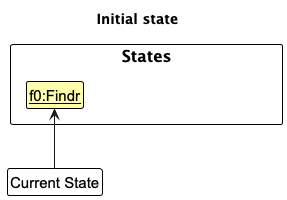

Step 2. The user executes `delete 5` command to delete the 5th person in findr. The `delete` command calls `Model#commitFindr()`, causing the modified state of findr after the `delete 5` command executes to be saved in the `findrStateList`, and the `currentStatePointer` is shifted to the newly inserted findr state.

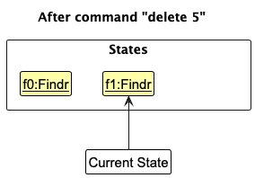

Step 3. The user executes `add n/David …​` to add a new person. The `add` command also calls `Model#commitFindr()`, causing another modified findr state to be saved into the `findrStateList`.

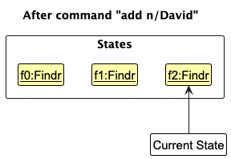

<div markdown="span" class="alert alert-info">

:information_source: **Note:** If a command fails its execution, it will not call `Model#commitFindr()`, so the findr state will not be saved into the `findrStateList`.
</div>

Step 4. The user now decides that adding the person was a mistake, and decides to undo that action by executing the `undo` command. The `undo` command will call `Model#undoFindr()`, which will shift the `currentStatePointer` once to the left, pointing it to the previous findr state, and restores findr to that state.

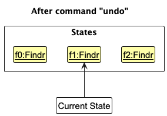

<div markdown="span" class="alert alert-info">

:information_source: **Note:** If the `currentStatePointer` is at index 0, pointing to the initial findr state, then there are no previous findr states to restore. The `undo` command uses `Model#canUndoFindr()` to check if this is the case. If so, it will return an error to the user rather
than attempting to perform the undo.
</div>

The following sequence diagram shows how an undo operation goes through the `Logic` component:

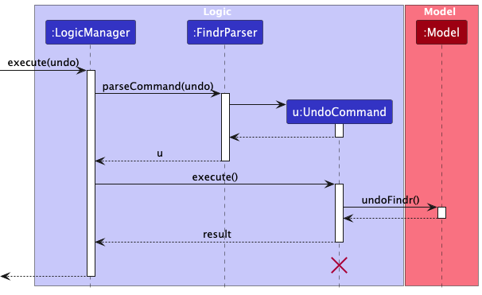

<div markdown="span" class="alert alert-info">

:information_source: **Note:** The lifeline for `UndoCommand` should end at the destroy marker (X) but due to a limitation of PlantUML, the lifeline reaches the end of diagram.
</div>

Similarly, how an undo operation goes through the `Model` component is shown below:

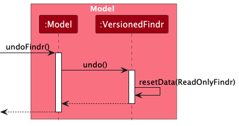

The `redo` command does the opposite — it calls `Model#redoFindr()`, which shifts the `currentStatePointer` once to the right, pointing to the previously undone state, and restores findr to that state.

<div markdown="span" class="alert alert-info">

:information_source: **Note:** If the `currentStatePointer` is at index `findrStateList.size() - 1`, pointing to the latest findr state, then there are no undone findr states to restore. The `redo` command uses `Model#canRedoFindr()` to check if this is the case. If so, it will return an error to the user rather than attempting to perform the redo.
</div>

Step 5. The user then decides to execute the command `list`. Commands that do not modify findr, such as `list`, will usually not call `Model#commitFindr()`, `Model#undoFindr()` or `Model#redoFindr()`. Thus, the `findrStateList` remains unchanged.

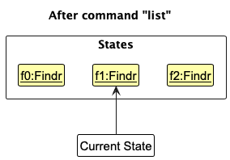

Step 6. The user executes `clear`, which calls `Model#commitFindr()`. Since the `currentStatePointer` is not pointing at the end of the `findrStateList`, all findr states after the `currentStatePointer` will be purged. Reason: It no longer makes sense to redo the `add n/David …​` command. This is the behavior that most modern desktop applications follow.

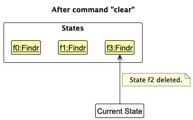

The following activity diagram summarizes what happens when a user executes a new command:

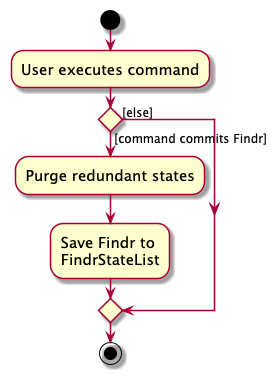

#### Design considerations:

**Aspect: How undo & redo executes:**

* **Alternative 1 (current choice):** Saves the entire findr.
  * Pros: Easy to implement.
  * Cons: May have performance issues in terms of memory usage.

* **Alternative 2:** Individual command knows how to undo/redo by
  itself.
  * Pros: Will use less memory (e.g. for `delete`, just save the person being deleted).
  * Cons: We must ensure that the implementation of each individual command are correct.

_{more aspects and alternatives to be added}_

### \[Proposed\] Advanced candidate search and filtering

#### Proposed Implementation

The proposed advanced search mechanism is facilitated by `AdvancedSearchManager`.
It extends findr with advanced filtering capabilities, stored internally as a
`searchPredicateStack` and `currentSearchPredicate`. Additionally, it implements
the following operations:

* `AdvancedSearchManager#compilePredicate()` - Compiles multiple search criteria into a single executable predicate.
* `AdvancedSearchManager#saveFilter()` - Stores the current search filter for future reuse.
* `AdvancedSearchManager#loadFilter()` - Retrieves a previously saved search filter.

These operations are exposed in the Model interface as `Model#compileSearchPredicate()`,
`Model#saveSearchFilter()` and `Model#loadSearchFilter()` respectively.

Given below is an example usage scenario and how the advanced search mechanism behaves at each step.

**Step 1**. The user launches the application and wants to find senior backend developers.
The `AdvancedSearchManager` will be initialized with an empty search predicate stack.
The class structure shows how AdvancedSearchManager integrates with the existing system components.


**Step 2**. The user executes `filter tn/Java tn/Spring r/Good-Excellent yoe/5-10` to find 
candidates with Java and Spring tags, rated Good to Excellent, with 5-10 years
experience. The filter command calls `Model#compileSearchPredicate()`, causing
the search criteria to be compiled into a composite predicate, and the candidate 
list is filtered to show only matching candidates. The sequence diagram illustrates the complete flow from user input to filtered results.

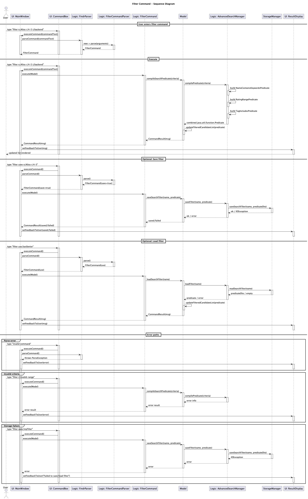

**Step 3**. The user realizes they also want to filter by location and 
executes `filter loc/Singapore sal/80000-120000`. The filter command calls 
`Model#compileSearchPredicate()` again, combining the new criteria with 
the existing ones, and updates the filtered candidate list.

**:information_source: Note:** If the search criteria are invalid (e.g., 
malformed ranges), the command will not call `Model#compileSearchPredicate()`,
so the filter state will not be updated.

**Step 4**. The user now decides this is a useful filter combination and wants 
to save it by executing `filter save/senior-backend-sg`. The save command calls
`Model#saveSearchFilter()`, which stores the current predicate configuration as
"senior-backend-sg" for future use. The activity diagram shows the complete workflow
for saving and reusing search filters.

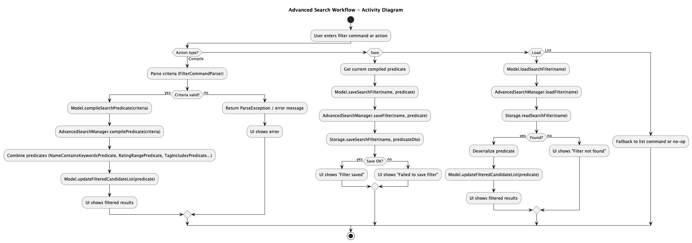

:information_source: Note: If a filter with the same name already exists, the save
operation will overwrite it. The command uses `Model#isValidFilterName()` to check 
if the name is valid. If not, it will return an error to the user.

**Step 5**. The user clears the current filter with filter clear and works 
with other candidates. Later, they want to reuse the saved filter and execute
`filter use/senior-backend-sg`. The use command calls `Model#loadSearchFilter()`, 
which retrieves the saved predicate and applies it to the current candidate 
list. The component diagram illustrates how search components interact within 
the overall system architecture.

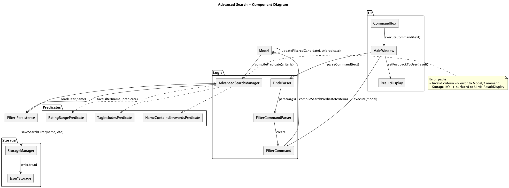

**Step 6**. The user executes `list` to view all candidates again. The list 
command clears any active filters and displays the full candidate database.

:information_source: Note: Non-filtering commands like `list` and `help` do not 
affect the search predicate stack, allowing users to return to their filtered 
view after performing other operations.

**Step 7**. The user executes a new filter command with different criteria. 
Since the search predicate stack maintains the current active filter, applying
a new filter replaces the current one rather than accumulating criteria.

:information_source: Note: This behavior follows the principle of least surprise, 
where each filter command represents a complete new query rather than incremental 
additions to the previous filter.

#### Design Considerations

**Aspect: How search predicates are combined:**

* **Alternative 1 (current choice):** Each filter command represents a complete new query

    * Pros: Predictable behavior, easy to understand and matches mental model of search queries
    * Cons: Cannot incrementally add/remove criteria from current filter

* **Alternative 2:** Filter commands modify current predicate incrementally

    * Pros: More flexible for refining searches, preserves work in complex filtering
    * Cons: Complex implementation, unpredictable behavior for users and harder to manage predicate state

**Aspect: How complex boolean logic is handled:**

* **Alternative 1 (current choice):** Implicit AND between criteria with explicit OR groups

    * Pros: Intuitive for most users, covers 90% of use cases, simple syntax
    * Cons: Limited expressiveness for complex boolean logic

* **Alternative 2**: Full boolean expression parser

    * Pros: Maximum flexibility for power users and can express any logical combination
    * Cons: Complex syntax, steep learning curve and difficult to parse and validate

**Aspect: Filter persistence strategy:**

* **Alternative 1 (current choice):** Saved filters stored in separate configuration file

    * Pros: Easy to back up and share filters which are separate from main data file
    * Cons: Additional files to manage and potential sync issues

* **Alternative 2:** Saved filters embedded in main data file 
  * Pros: Single file management and automatic inclusion in backups
  * Cons: Bloat main data file and also harder to export/import just filters

--------------------------------------------------------------------------------------------------------------------

## **Documentation, logging, testing, configuration, dev-ops**

* [Documentation guide](Documentation.md)
* [Testing guide](Testing.md)
* [Logging guide](Logging.md)
* [Configuration guide](Configuration.md)
* [DevOps guide](DevOps.md)

--------------------------------------------------------------------------------------------------------------------

## **Appendix: Requirements**

### Product scope

**Target user profile**:

* tech firm recruiters
* has a need to manage a significant number of contacts
* prefer desktop apps over other types
* can type fast
* prefers typing to mouse interactions
* is reasonably comfortable using CLI apps

**Value proposition**: findr aims to equip recruiters with a one-stop solution for tech talent.
Our platform centralizes candidate data, streamlines communication, and provides analytics to help you identify,
assess, and engage top-tier candidates. Go beyond the resume to find the perfect fit.


### User stories

Priorities: High (must have) - `* * *`, Medium (nice to have) - `* *`, Low (unlikely to have) - `*`

| Priority | As a …​                         | I want to …​                                     | So that I can…​                                                  |
|----------|---------------------------------|--------------------------------------------------|------------------------------------------------------------------|
| `* * *`  | new recruiter                   | see usage instructions                           | refer to instructions when I forget how to use the App           |
| `* * *`  | recruiter                       | add a potential candidate                        | keep track of all possible candidates                            |
| `* * *`  | recruiter                       | edit details of my candidates                    | keep my information of candidates up to date                     |
| `* * *`  | meticulous recruiter            | delete candidates I am no longer considering     | reduce clutter on my candidate list                              |
| `* * *`  | recruiter                       | find a candidate by name                         | easily locate details of a specific candidates                   |
| `* * *`  | recruiter                       | see all candidates in the list                   | view all candidates conveniently                                 |
| `* *`    | recruiter                       | autosave my changes                              | not lose my work accidentally                                    |
| `* *`    | recruiter with many candidates  | sort candidates by alphabetical order            | easily navigate the candidate list                               |
| `* *`    | recruiter with many candidates  | sort candidates by date added                    | easily navigate the candidate list                               |
| `* *`    | recruiter with many candidates  | sort candidates by rating                        | easily navigate the candidate list                               |
| `* *`    | recruiter                       | assign candidates with ratings                   | evaluate their performance at a glance                           |
| `* *`    | organized recruiter             | split my candidates into columns                 | easily identify candidates under different stages of recruitment |
| `* *`    | recruiter                       | assign tags to my candidates                     | easily view their traits and skills                              |
| `* *`    | recruiter                       | create new tags                                  | customize my tagging of candidates                               |
| `* *`    | recruiter                       | view all tags                                    | keep track of my existing tags                                   |
| `* *`    | recruiter                       | edit my existing tags                            | customize my tagging of candidates                               |
| `* *`    | meticulous recruiter            | delete unused tags                               | reduce clutter on my tag list                                    |
| `* *`    | impatient recruiter             | access my previously used commands with a button | reduce time taken to type the same command again                 |

### Use cases

(For all use cases below, the **System** is `findr` and the **Actor** is the `Recruiter`, unless specified otherwise)

**Use case: UC01 - View the kanban board**

**MSS**
1. Actor requests to view the recruitment board (e.g. enters `list`).
2. System displays all stages with each candidate card and summary details.

   Use case ends.

**Extensions**
* 1a. No candidates exist in storage.

  1a1. System shows empty kanban columns.

  Use case ends.

---

**Use case: UC02 - Add a candidate**

**MSS**
1. Actor gathers the candidate's mandatory details and any tag names defined in the tag catalogue.
2. Actor submits an add command with the details.
3. System validates the fields and creates the candidate in the `Candidates` stage.
4. System shows a success message and refreshes the board.

   Use case ends.

**Extensions**
* 1a. Actor references a tag name that does not exist in the catalogue.

  1a1. System rejects the command and lists the missing tag names.

  Use case resumes at step 1.

* 2a. Required fields are missing or malformed.

  2a1. System rejects the command and highlights the problematic fields.

  Use case resumes at step 2.

* 2b. The candidate duplicates an existing record (e.g. same email).

  2b1. System warns about the duplicate and aborts creation.

  Use case resumes at step 2 if the actor chooses to amend the command.

---

**Use case: UC03 - Edit a candidate**

**MSS**
1. Actor identifies a candidate by its stage and index.
2. Actor submits an edit command with the updated fields.
3. System validates the request and applies the updates.
4. System shows a success message and refreshes the affected candidate card.

   Use case ends.

**Extensions**
* 1a. The specified index is out of range for the chosen stage.

  1a1. System rejects the command and reminds the actor to check the stage list.

  Use case resumes at step 1.

* 2a. The edited fields reuse tags that are not in the catalogue.

  2a1. System rejects the command and lists missing tag names.

  Use case resumes at step 2.

* 2b. No editable fields are provided.

  2b1. System rejects the command and prompts the actor to include at least one field.

  Use case resumes at step 2.

---

**Use case: UC04 - Find candidates by keyword**

**MSS**
1. Actor specifies one or more name keywords.
2. System filters the candidates whose names match the keywords and shows the narrowed board.

   Use case ends.

**Extensions**
* 1a. No candidates match the keywords.

  1a1. System shows an empty result list with a suitable message.

  Use case ends.

---

**Use case: UC05 - Delete a candidate**

**MSS**
1. Actor identifies the candidate's index within a stage.
2. Actor submits a delete command with the index and stage.
3. System validates the input and removes the candidate from storage.
4. System shows a success message with the deleted candidate's summary.

   Use case ends.

**Extensions**
* 1a. The given index is invalid for the displayed stage.

  1a1. System shows an error and keeps the board unchanged.

  Use case resumes at step 1.

* 1b. The stage argument is misspelled or omitted.

  1b1. System rejects the command and displays the valid stage names.

  Use case resumes at step 1.

---

**Use case: UC06 - Move a candidate between stages**

**MSS**
1. Actor identifies a candidate by stage and index, and chooses a destination stage.
2. Actor submits a move command specifying the source and destination stages.
3. System validates the move and updates the candidate's stage.
4. System shows a success message with the new stage.

   Use case ends.

**Extensions**
* 1a. The source stage index is invalid or the stage has no candidates.

  1a1. System shows an error and keeps the board unchanged.

  Use case resumes at step 1.

* 1b. The source and destination stages are the same.

  1b1. System rejects the command and reminds the actor to pick a different destination.

  Use case resumes at step 1.

* 2a. The destination stage name is misspelled.

  2a1. System rejects the command and lists valid stage names.

  Use case resumes at step 2.

---

**Use case: UC07 - Rate a candidate**

**MSS**
1. Actor identifies a candidate by stage and index.
2. Actor submits a rate command with the desired rating.
3. System validates the rating value and updates the candidate.
4. System shows a success message and refreshes the candidate card.

   Use case ends.

**Extensions**
* 1a. The specified index is invalid for the stage.

  1a1. System rejects the command and explains the valid index range.

  Use case resumes at step 1.

* 2a. The rating value is not one of the supported options.

  2a1. System rejects the command and lists the allowed ratings.

  Use case resumes at step 2.

---

**Use case: UC08 - Sort candidates**

**MSS**
1. Actor chooses a sort criterion (alphabetical, date, or rating).
2. Actor issues the sort command.
3. System validates the criterion and reorders the board accordingly.
4. System shows a success message.

   Use case ends.

**Extensions**
* 1a. Actor specifies an unsupported criterion.

  1a1. System rejects the command and lists valid options.

  Use case resumes at step 1.

---

**Use case: UC09 - Clear candidates**

**MSS**
1. Actor decides whether to clear a single stage or the entire board.
2. Actor submits a clear command with the chosen scope.
3. System validates the scope and removes the corresponding candidates.
4. System shows a confirmation message.

   Use case ends.

**Extensions**
* 1a. Actor tries to clear a stage that is already empty.

  1a1. System informs the actor that there are no candidates to remove.

  Use case ends.

* 2a. The stage argument is invalid.

  2a1. System rejects the command and lists valid stage names.

  Use case resumes at step 2.

---

**Use case: UC10 - Add a tag definition**

**MSS**
1. Actor identifies a new tag name, optional category, colour, and description.
2. Actor issues a tag creation command with the details.
3. System validates the fields and adds the tag to the catalogue.
4. System shows a success message and refreshes the tag list panel.

   Use case ends.

**Extensions**
* 1a. Actor specifies a tag name that already exists.

  1a1. System rejects the command and points to the existing tag entry.

  Use case resumes at step 1.

* 2a. The colour code or name format is invalid.

  2a1. System rejects the command and explains the expected format.

  Use case resumes at step 2.

---

**Use case: UC11 - Edit a tag definition**

**MSS**
1. Actor selects a tag to update by its current name.
2. Actor issues a tag edit command with the new attributes.
3. System validates the request, updates the catalogue, and cascades changes to affected candidates.
4. System shows a success message and refreshes the tag list panel.

   Use case ends.

**Extensions**
* 1a. The referenced tag name does not exist.

  1a1. System rejects the command and prompts the actor to list available tags.

  Use case resumes at step 1.

* 2a. The updated tag name collides with another tag.

  2a1. System rejects the command and highlights the conflicting name.

  Use case resumes at step 2.

---

**Use case: UC12 - Delete a tag definition**

**MSS**
1. Actor selects a tag to remove.
2. Actor issues a tag delete command.
3. System validates the tag name, removes it from the catalogue, and detaches it from all candidates.
4. System shows a success message and refreshes the tag list panel.

   Use case ends.

**Extensions**
* 1a. The tag name does not exist.

  1a1. System rejects the command and prompts the actor to use `taglist`.

  Use case resumes at step 1.

---

**Use case: UC13 - List tag definitions**

**MSS**
1. Actor requests to view the tag catalogue.
2. System displays all tag entries with their attributes.

   Use case ends.

**Extensions**
* 1a. The catalogue is empty.

  1a1. System shows an empty state message encouraging the actor to add tags.

  Use case ends.

---

**Use case: Auto-save changes**

**MSS**
1. Actor performs a change (e.g. add, delete, edit).
2. System automatically persists the change to storage.
3. System shows a brief "Saved" status.

   Use case ends.

**Extensions**
* 2a. Temporary storage failure (e.g. file lock, I/O error).

  2a1. System queues a retry and shows a non-intrusive warning.

  2a2. If retry succeeds, System shows "Saved" and logs the event.

  2a3. If retry fails after N attempts, System prompts the recruiter to "Retry now" or "Save As…".

  Use case ends.

* 2b. Storage is unavailable (e.g. permission denied).

  2b1. System prevents further destructive actions and displays recovery guidance.

  Use case ends.

### Non-Functional Requirements

1.  Should work on any _mainstream OS_ as long as it has Java `17` or above installed.
2.  Should be able to hold up to 1000 persons without a noticeable sluggishness in performance for typical usage.
3.  A user with above average typing speed for regular English text (i.e. not code, not system admin commands) should be able to accomplish most of the tasks faster using commands than using the mouse.
4.  The UI should be intuitive enough for basic use without training.
5.  Data must save automatically after each change to prevent data loss.
6.  The codebase must be well-documented and adhere to coding standards.

### Glossary

Term | Definition
--------|------------------
**Actor** | A role (e.g. recruiter) interacting with the system in a use case.
**System** | Refers to the `findr` application in use cases.
**Kanban Board** | A visual workflow management tool that organizes candidates into columns representing different recruitment stages.
**Auto-save** | A system feature that automatically persists changes without explicit user action.
**Candidate** | A person added to the system by a recruiter as a potential hire.
**Mainstream OS** | Windows, Linux, Unix, MacOS (as stated in non-functional requirements).
**Override** | An action that allows bypassing system warnings (e.g. creating a candidate despite duplicates).
**Recruiter** | The primary user of `findr` who manages and tracks potential candidates.
**Tag** | A keyword or label assigned to a candidate (e.g. “Java,” “Frontend”) to aid categorization and search.

--------------------------------------------------------------------------------------------------------------------

## **Appendix: Instructions for manual testing**

Given below are instructions to test the app manually.

<div markdown="span" class="alert alert-info">

:information_source: **Note:** These instructions only provide a starting point for testers to work on;
testers are expected to do more *exploratory* testing.
</div>

### Launch and shutdown

1. Initial launch

    1. Download the jar file and copy it into an empty folder.

   1. Double-click the jar file.<br>
      Expected: `findr` starts with the kanban board populated using the sample candidates and the catalogue of predefined tags
      (e.g. `frontend`, `backend`).

1. Saving window preferences

   1. Resize the window to an optimum size. Move the window to a different location. Close the window.

   1. Relaunch the app by double-clicking the jar file.<br>
      Expected: The most recent window size and location is retained.

1. Fresh state

    1. Run `clear all` to remove sample candidates.<br>
       Expected: All kanban columns become empty while the tag catalogue remains available for reuse.<br>
   Warning: This function is irreversible so for testing purposes, it is recommended that you only do this at the end.

### Candidate and kanban workflow

1. Adding and editing a candidate

   1. Run `tagadd tn/contractor tc/Engagement tcol/#FF9F1C td/Ready for short-term roles` to create a reusable tag.<br>
      Expected: Success message confirms the new tag is available in the catalogue (visible in `taglist`).

   1. Run `add n/Gina Lim p/91234567 e/gina.lim@talentmail.com a/123 Market Street t/contractor`.<br>
      Expected: A candidate card for Gina appears in the **Candidates** column with rating `Unrated` and the `contractor` tag badge.

   1. Run `edit 1 from/Candidates p/93335555 e/gina.lim@talenthub.io`.<br>
      Expected: The candidate card keeps its position in the Candidates column but reflects the updated phone number and email.

1. Moving candidates between stages

   1. Run `move 1 from/Candidates to/Contacted`.<br>
      Expected: The candidate card moves into the **Contacted** column with a refreshed index within that column. The result message summarises the stage transition.

1. Rating candidates

    1. Run `rate 1 from/Contacted r/Good`.<br>
       Expected: The candidate card shows the `Good` rating badge and the success message acknowledges the rating update. Stage placement remains unchanged.

1. Deleting candidates from a stage

    1. Run `delete 1 from/Contacted`.<br>
       Expected: The candidate card disappears from the Contacted column and the status message references the removed candidate.

1. Sorting candidates

    1. Add a few candidates using the `add` command with varying rating and names.

    1. Run `sort rating`.<br>
       Expected: The board reorders candidates so that higher-rated candidates (e.g. `Excellent`) appear before lower-rated ones within each stage, and the result message states that sorting succeeded.

    1. Run `sort date`.<br>
       Expected: Candidates reorder by their `Date Added` values with the oldest dates appearing first.

    1. Run `sort` (with no arguments).<br>
       Expected: Candidates reorder alphabetically by name.

1. Clearing stages safely

    1. Run `clear Interviewed`.<br>
       Expected: Only the **Interviewed** column becomes empty. Other stages and the tag catalogue stay intact.

### Tag catalogue management

These tests ensure the global tag catalogue stays in sync with candidate cards.

1. Listing tags

    1. Run `taglist`.<br>
       Expected: The result panel shows the predefined tags (e.g. `frontend`, `backend`) and any tags you added earlier such as `contractor`.

1. Editing a tag

    1. Run `tagedit tn/contractor nn/helper tcol/#FFB347`.<br>
       Expected: The catalogue now lists `helper` with the updated colour. Any candidate using the original `contractor` tag should display the renamed tag automatically.

1. Deleting a tag

    1. Run `tagdelete tn/helper`.<br>
       Expected: The tag disappears from `taglist`, and any candidate that previously displayed it no longer shows the badge.

### Data persistence and recovery

1. Auto-saving candidate data

    1. After modifying candidates (e.g. completing the add/edit/move/rate flow above), exit the app with `exit`.

    1. Navigate to the `data` folder beside the jar and open `findr.json` in a text editor.<br>
       Expected: The JSON contains the latest candidate details you observed before exiting, including stage, rating, and tags.

    1. Relaunch the app.<br>
       Expected: The kanban board reflects the saved state from the JSON file.

1. Handling corrupted data files

    1. With the app closed, create a backup of `data/findr.json`, then deliberately introduce a syntax error (e.g. delete the final closing brace) in the original file.

    1. Launch the app.<br>
       Expected: `findr` starts with an empty candidate list and recreates a valid `findr.json`. Restore from the backup to continue testing.

1. Preferences recovery

    1. Delete the `preferences.json` file in the same directory as the jar (if it exists) and relaunch the app.<br>
       Expected: `findr` recreates the file with default window dimensions and position.
