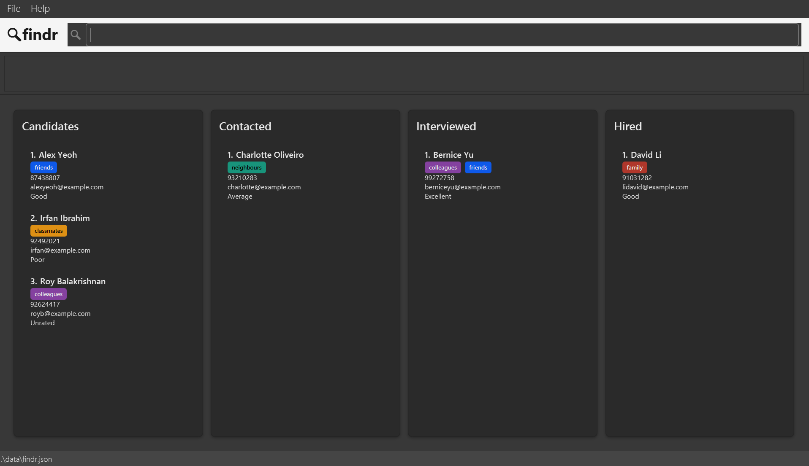
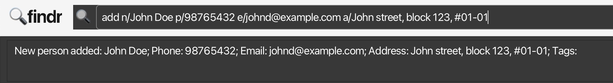
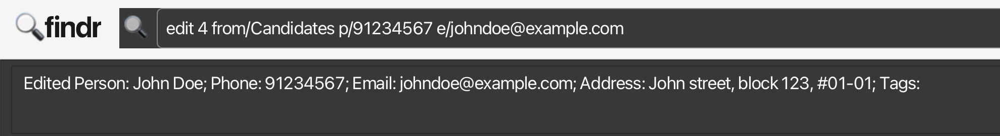
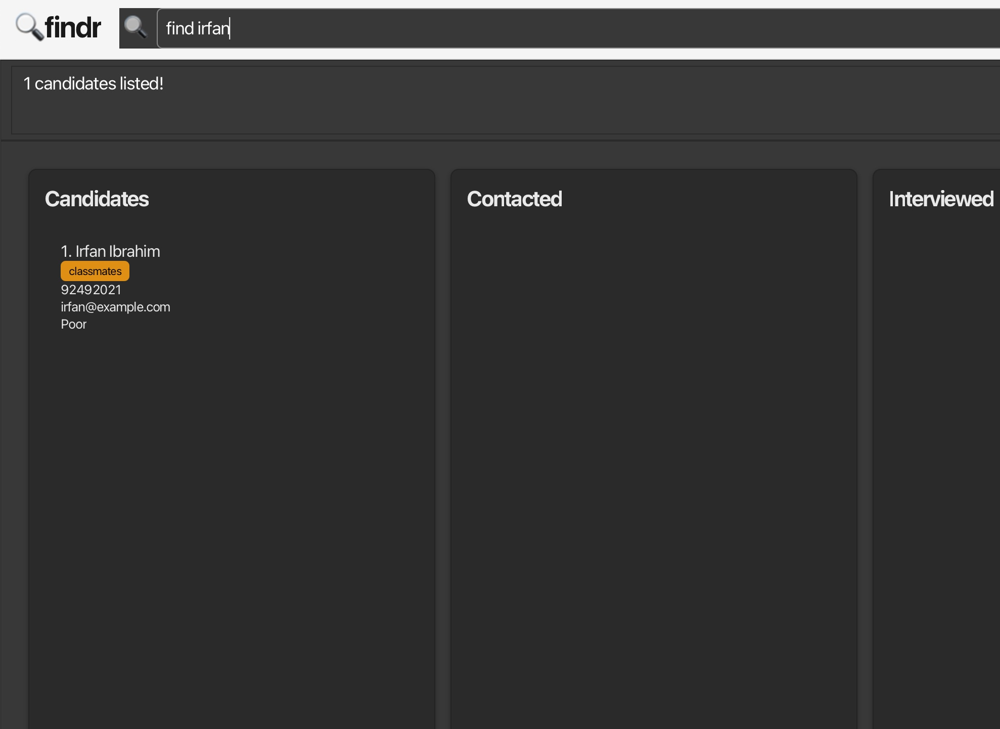
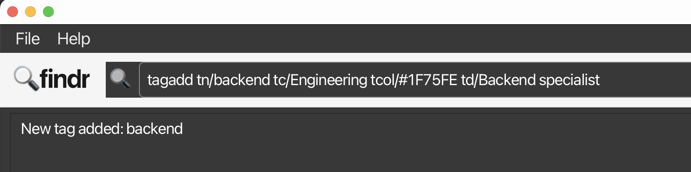

* Table of Contents
{:toc}
---
# :mag:findr

`findr` is a **desktop app for recruiters to manage candidates, optimized for use via a Command Line Interface** (CLI) while still having the benefits of a Graphical User Interface (GUI). If you can type fast, `findr` can get your candidate management tasks done faster than traditional GUI apps.

--------------------------------------------------------------------------------------------------------------------

## Quick Start

1. Ensure you have Java `17` or above installed in your Computer.
   - Check if Java is already installed in the command terminal by typing in: `java -version`. 
   - If the version shown is Java 17 or higher, you will be able to run `findr` smoothly. 
   - If not, download and install java 17 from [Oracle](https://www.oracle.com/java/technologies/downloads/#java17).
   - **Mac users:** Ensure you have the precise JDK version prescribed [here](https://se-education.org/guides/tutorials/javaInstallationMac.html).

2. Download the latest `[CS2103T-F14a-2][findr].jar` file from [here](https://github.com/AY2526S1-CS2103T-F14a-2/tp/releases).

3. Copy the file to the folder you want to use as the _home folder_ for your `findr` app.

4. Open a command terminal, navigate into the folder you put the jar file in using the `cd` command (change directory).
   - For example, if you put the jar file in C:\Users\Recruiter\findr\, use the following command in the terminal:
> cd C:\Users\Recruiter\findr\

5. Use the `java -jar [CS2103T-F14a-2][findr].jar` command to run the application. 
   A GUI similar to the below should appear in a few seconds. Note how the app contains some sample data. 
   

5. Type a command in the command box and press Enter to execute it. e.g. typing **`help`** and pressing Enter will open the help window. 
   Some example commands you can try:

   * `list` : Lists all candidates.

   * `add n/John Doe p/98765432 e/johnd@example.com a/John street, block 123, #01-01` : Adds a candidate named `John Doe` to the candidate list.

   * `delete 3 from/Candidates` : Deletes the 3rd candidate from Candidate stage shown in the current list.
   
   * `sort` : Sorts the candidate list alphabetically.

   * `clear all` : Deletes all candidates.

   * `exit` : Exits the app.

1. Refer to the [Features](#features) below for details of each command.
2. If you want to start a new contact list from scratch using `findr`, use the `clear all` command, which will clear all the sample data from `findr`.

--------------------------------------------------------------------------------------------------------------------

## Features

**:information_source: Notes about the command format:** 

* Words in `UPPER_CASE` are the parameters to be supplied by the user. 
  e.g. in `add n/NAME`, `NAME` is a parameter which can be used as `add n/John Doe`.

* Items in square brackets are optional. 
  e.g `n/NAME [t/TAG]` can be used as `n/John Doe t/friend` or as `n/John Doe`.

* Items with `…`​ after them can be used multiple times including zero times. 
  e.g. `[t/TAG]…​` can be used as ` ` (i.e. 0 times), `t/friend`, `t/friend t/family` etc.

* Parameters can be in any order. 
  e.g. if the command specifies `n/NAME p/PHONE_NUMBER`, `p/PHONE_NUMBER n/NAME` is also acceptable.

* Extraneous parameters for commands that do not take in parameters (such as `help`, `list` and `exit`) will be ignored. 
  e.g. if the command specifies `help 123`, it will be interpreted as `help`.

* If you are using a PDF version of this document, be careful when copying and pasting commands that span multiple lines as space characters surrounding line-breaks may be omitted when copied over to the application.

### Viewing help : `help`

Shows a message explaining how to access the help page. 

When findr is in full screen, the help window will be opened in a seperate full screen window.

Format: `help`

### Adding a candidate: `add`

Adds a candidate to the candidate list.

Format: `add n/NAME p/PHONE_NUMBER e/EMAIL a/ADDRESS [t/TAG]…​`

* Adds a new candidate to the candidate list in the `Candidates` stage. 
* New candidate created with the specified `NAME`, `PHONE_NUMBER`, `EMAIL_ADDRESS`,`ADRESS` and `[TAG]`. 
* If no `[TAG]` specified, candidate is created with no tags by default. 
* `[TAG]` has to be created using [tag commands](#commands-for-managing-tags--) before adding to candidates. 
* Candidate is created with date added as current date and rating as `UNRATED`.
* Names should only contain letters (including accented characters), numbers, spaces, apostrophes, '@', hyphens, may include 's/o' or 'd/o', and it should not be blank.
* Adding of duplicate candidates (candidates with the same phone number or email) are not allowed.

Examples:
* `add n/John Doe p/98765432 e/johnd@example.com a/John street, block 123, #01-01`
* `add n/Jo-hn 2 doé s/o @ betsy t/friend e/betsy@example.com a/Newgate Prison p/1234567 t/criminal`

:bulb: **Tip:**
A candidate can have any number of tags (including 0)

### Listing all candidates : `list`

Shows a list of all candidates in the candidate list.

Format: `list`

:bulb: **Tip:**
Use this after finding candidates by name to view the entire list again.

### Editing a candidate : `edit`

Edits an existing candidate in the candidate list.

Format: `edit INDEX from/STAGE [n/NAME] [p/PHONE] [e/EMAIL] [a/ADDRESS] [t/TAG]…​`

* Edits the candidate at the specified `INDEX`. The index refers to the index number shown in the displayed candidate list in the specified `STAGE`. The index **must be a positive integer** 1, 2, 3, …​
* At least one of the optional fields must be provided.
* Existing values will be updated to the input values.
* When editing tags, the existing tags of the candidate will be removed i.e adding of tags is not cumulative.
* You can remove all the candidate’s tags by typing `t/` without specifying any tags after it.
* Valid stages: `Candidates`, `Contacted`, `Interviewed`, `Hired` (case-insensitive)

Examples:
*  `edit 1 from/Candidates p/91234567 e/johndoe@example.com` Edits the phone number and email address of the 1st candidate in the Candidate stage to be `91234567` and `johndoe@example.com` respectively.
*  `edit 2 from/Interviewed n/Betsy Crower t/` Edits the name of the 2nd candidate in the Interviewed stage to be `Betsy Crower` and clears all existing tags.

### Locating candidates by name: `find`

Finds candidates whose names contain any of the given keywords.

Format: `find KEYWORD [MORE_KEYWORDS]`

* The search is case-insensitive. e.g `hans` will match `Hans`
* The order of the keywords does not matter. e.g. `Hans Bo` will match `Bo Hans`
* Only the name is searched.
* Only full words will be matched e.g. `Han` will not match `Hans`
* Candidates matching at least one keyword will be returned (i.e. `OR` search).
  e.g. `Hans Bo` will return `Hans Gruber`, `Bo Yang`
* Order of results are determined by the last sort command (e.g. if sorted alphabetically, John Coe appears before John Doe). 

Examples:
* `find John` returns `john` and `John Doe`
* `find alex david` returns `Alex Yeoh`, `David Li` 
  

### Deleting a candidate : `delete`

Deletes the specified candidate from the candidate list or from a specific kanban board stage.

Format: `delete INDEX from/STAGE`

* Deletes the candidate at the specified `INDEX` and `STAGE`, the index refers to the position within that specific stage column in the kanban board.
* The index **must be a positive integer** 1, 2, 3, …​
* Valid stages: `Candidates`, `Contacted`, `Interviewed`, `Hired` (case-insensitive)

Examples:
* `list` followed by `delete 2 from/Contacted` deletes the 2nd candidate in the Contacted stage of the kanban board.
* `find Betsy` followed by `delete 1 from/Candidates` deletes the 1st candidate in the Candidates stage in the results of the `find` command.
* `delete 3 from/interviewed` deletes the 3rd candidate in the Interviewed stage (case-insensitive).

### Moving a candidate between stages : `move`

Moves a candidate from one recruitment stage to another in the kanban board.

Format: `move INDEX from/CURRENT_STAGE to/NEW_STAGE`

* Moves the candidate at the specified `INDEX` from `CURRENT_STAGE` to `NEW_STAGE`.
* The index refers to the index number shown **within the specified stage column**.
* The index **must be a positive integer** 1, 2, 3, …​
* Valid stages: `Candidates`, `Contacted`, `Interviewed`, `Hired` (case-insensitive).
* You cannot move a candidate to the same stage they are currently in.

Examples:
* `move 1 from/Candidates to/Contacted` moves the 1st candidate in the Candidates column to the Contacted stage.
* `move 2 from/Interviewed to/Hired` moves the 2nd candidate in the Interviewed column to the Hired stage.
* `move 1 from/contacted to/INTERVIEWED` also works (case-insensitive stage names).

:bulb: **Tip:**
The index shown on each candidate card in the kanban board corresponds to their position within that specific stage column. Use this index when moving candidates.

### Rating a candidate : `rate`

Sets or updates a candidate's rating.

Format: `rate INDEX from/STAGE r/RATING`

* Rates the candidate at the specified `INDEX`.
* The `from/STAGE` is required and scopes the index to that stage column.
* The index **must be a positive integer** 1, 2, 3, …
* Valid stages: `Candidates`, `Contacted`, `Interviewed`, `Hired` (case-insensitive).
* Valid ratings: `Unrated`, `Very Poor`, `Poor`, `Average`, `Good`, `Excellent` (case-insensitive).

Examples:
* `rate 1 from/Candidates r/Excellent` rates the 1st candidate in the Candidates column as Excellent.
* `rate 2 from/Interviewed r/Good` rates the 2nd candidate in the Interviewed column as Good.
* `rate 3 from/Contacted r/Very Poor` rates the 3rd candidate in the Contacted column as Very Poor.

### Sorting candidates : `sort`

Sorts candidates by a sorting criteria

Format: `sort [SORT_CRITERIA]`

* Sorts all candidates in all stages based on the specified `[SORT_CRITERIA]`.
* If no `[SORT_CRITERIA]` provided, candidates are sorted alphabetically by candidate name by default. 
* Valid sort criteria: `Alphabetical`, `Date`, `Rating` (case-insensitive).

`alphabetical` - sorts alphabetically by candidate name

`date` - sorts by date added to `findr`

`rating` - sorts by rating

Examples:
* `sort` sorts all candidates alphabetically. 
* `sort date` sorts all candidates by date added. 

### Clearing all entries : `clear`

Clears candidates from the candidate list.

Format: `clear [STAGE]`

* Deletes all candidates from the specified `STAGE`. 
* Valid stages: `Candidates`, `Contacted`, `Interviewed`, `Hired`, `All` (case-insensitive).

Examples:
* `clear all` deletes all candidates from all stages. 
* `clear` also deletes all candidates from all stages. 
* `clear Interviewed` deletes all candidates from Interviewed stage. 

**Warning:**
The `clear` command permanently deletes all candidate data and **cannot be undone**.

### Navigating search history : `↑` or `↓`
Use the UP arrow key to view previous commands and the DOWN arrow key to navigate back to more recent commands.

Format: `↑` or `↓`

### Exiting the program : `exit`

Exits the program.

Format: `exit`

### Commands for Managing tags : 
`tagadd`, `tagedit`, `tagdelete`, `taglist`

Use the tag catalogue commands to define reusable tags for candidates.

#### Adding a tag definition : `tagadd`

Creates a new tag in the global tag catalogue.

Format: `tagadd tn/TAG_NAME [tc/CATEGORY] [tcol/COLOUR] [td/DESCRIPTION]`

* Adds a new tag with the specified `TAG_NAME`, `[CATEGORY]`, `[COLOUR]`, and `[DESCRIPTION]`.
* If not specified, new tag is created with `General` category, `#7A7A7A` color, and no description by default. 
* Tag names must be alphanumeric and unique.
* Tag names are case-sensitive and do not include spaces between.
* Valid tag names: `backend`, `lowpriority`, `database`.
* Invalid tag names: `back end`, `Low priority`.
* Tag colour must be 6 digit hexadecimal beginning with `#`

Examples:
* `tagadd tn/backend tc/Engineering tcol/#1F75FE td/Backend specialist` adds new tag called backend with specified fields
* `tagadd tn/urgent` adds new tag called urgent with default fields

#### Editing a tag definition : `tagedit`

Updates an existing tag in the catalogue.

Format: `tagedit tn/CURRENT_NAME [nn/NEW_NAME] [tc/CATEGORY] [tcol/COLOUR] [td/DESCRIPTION]`

* Edits the tag with the specified `CURRENT_NAME`
* At least one optional field must be provided.
* The new values replace the existing tag details. Updating the tag name updates candidates that use the tag.

Examples:
* `tagedit tn/backend tc/Product` edits backend tag to have a new category
* `tagedit tn/urgent nn/highpriority tcol/#FF0000` replaces urgent tag with `highpriority` and edits its colour to the one specified

#### Deleting a tag definition : `tagdelete`

Removes a tag from the catalogue.

Format: `tagdelete tn/TAG_NAME`

* Deleting a tag removes it from all candidates that were using it.

Example:
* `tagdelete tn/backend` removes backend tag from catalogue and all candidates

#### Listing all tag definitions : `taglist`

Shows all tag definitions in the catalogue with their category, colour, and description.

Format: `taglist`

Example:
* `taglist`

### Saving the data

Candidate list data are saved in the hard disk automatically after any command that changes the data. There is no need to save manually.

### Editing the data file

Candidate list data are saved automatically as a JSON file `[JAR file location]/data/findr.json`. Advanced users are welcome to update data directly by editing that data file.

:information_source: **NOTE:**
JSON file will only be created after first command run.

:exclamation: **CAUTION:**
If your changes to the data file makes its format invalid, `findr` will discard all data and start with an empty data file at the next run. Hence, it is recommended to take a backup of the file before editing it. 
Furthermore, certain edits can cause the `findr` to behave in unexpected ways (e.g., if a value entered is outside of the acceptable range). Therefore, edit the data file only if you are confident that you can update it correctly.

### New Features `[coming in v2.0]`
#### Head Hunting Platform Integration
* Integration with applications and platforms such as LinkedIn etc.
#### Stricter email rules
* Only contactable email adresses can be saved.
#### New add command parameters
* Users will be able to specify a particular stage and rating when adding new candidates to findr.
#### Enhanced find command
* Results will be sorted based on closeness to the keyword provided.

_Details coming soon ..._

--------------------------------------------------------------------------------------------------------------------

## FAQ

**Q**: How do I transfer my data to another Computer? 
**A**: Install the app in the other computer and overwrite the empty data file it creates with the file that contains the data of your previous `findr` home folder.

--------------------------------------------------------------------------------------------------------------------

## Known issues

1. **When using multiple screens**, if you move the application to a secondary screen, and later switch to using only the primary screen, the GUI will open off-screen. The remedy is to delete the `preferences.json` file created by the application before running the application again.

--------------------------------------------------------------------------------------------------------------------

## Command summary

Action | Format, Examples
--------|------------------
**Add** | `add n/NAME p/PHONE_NUMBER e/EMAIL a/ADDRESS [t/TAG]…​`   e.g. `add n/James Ho p/22224444 e/jamesho@example.com a/123, Clementi Rd, 1234665 t/friend t/colleague`
**Clear** | `clear [STAGE]`  e.g. `clear all`
**Delete** | `delete INDEX from/STAGE`  e.g. `delete 3 from/Contacted`
**Edit** | `edit INDEX from/STAGE [n/NAME] [p/PHONE_NUMBER] [e/EMAIL] [a/ADDRESS] [t/TAG]…​`  e.g.,`edit 2 from/Candidates n/James Lee e/jameslee@example.com`
**Find** | `find KEYWORD [MORE_KEYWORDS]`  e.g. `find James Jake`
**List** | `list`
**Move** | `move INDEX from/CURRENT_STAGE to/NEW_STAGE`  e.g. `move 1 from/Candidates to/Contacted`
**Rate** | `rate INDEX from/STAGE r/RATING`  e.g. `rate 1 from/Candidates r/Good`
**Sort** | `sort [SORT_CRITERIA]`  e.g. `sort alphabetical`
**Tag Add** | `tagadd tn/TAG_NAME [tc/CATEGORY] [tcol/COLOUR] [td/DESCRIPTION]`  e.g. `tagadd tn/urgent`
**Tag Edit** | `tagedit tn/CURRENT_NAME [nn/NEW_NAME] [tc/CATEGORY] [tcol/COLOUR] [td/DESCRIPTION]`  e.g. `tagedit tn/urgent nn/veryurgent`
**Tag Delete** | `tagdelete tn/TAG_NAME`  e.g. `tagdelete tn/veryurgent`
**Tag List** | `taglist`
**Navigate search history** | `↑` or `↓`
**Help** | `help`
**Exit** | `exit`

--------------------------------------------------------------------------------------------------------------------

## Glossary

Term | Definition
--------|------------------
**Alphanumeric** | Characters that consist of letters (A-Z, a-z) and numbers (0-9) only, with no special characters or spaces.
**CLI** | Command Line Interface - A text-based interface where you type commands to interact with the application, rather than clicking buttons.
**Command Terminal** | A text-based application (also called Command Prompt on Windows or Terminal on Mac/Linux) where you enter commands to run programs like `findr`.
**GUI** | Graphical User Interface - A visual interface with buttons, windows, and menus that you can interact with using a mouse.
**Stage** | A specific phase in the recruitment process (Candidates, Contacted, Interviewed, or Hired), represented as columns in the kanban board.
**Stage Column** | Refers to one of the vertical sections in the Kanban board UI (e.g., Candidates, Contacted, Interviewed, Hired). Each stage column contains the candidates currently in that stage.
**Kanban Board** | A visual workflow management tool that organizes candidates into columns representing different recruitment stages.
**Case Sensitivity** | The distinction between uppercase and lowercase letters. Case-insensitive means `Candidates`, `candidates`, and `CANDIDATES` are treated the same. 
**Hard disk** | Your computer's main storage device where files and data are permanently saved, even when the computer is turned off.
**Hexadecimal** | A color code format using 6 characters (0-9 and A-F) preceded by `#` (e.g., `#FF0000` for red). Used to specify custom tag colors.
**Java** | A programming language and computing platform required to run `findr`. Must be version 17 or higher.
**JDK** | Java Development Kit - The software package that includes everything needed to run Java applications on your computer.
**JSON** | JavaScript Object Notation - A file format used to store `findr`'s data in a structured, readable way. The file extension is `.json`.
**Oracle** | The technology company that develops and maintains Java. Their website provides official Java downloads.
